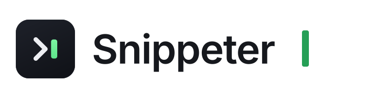
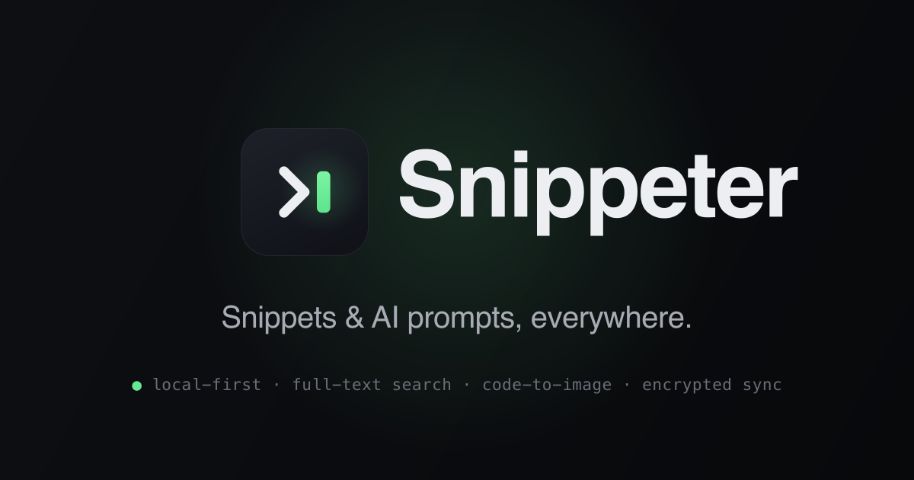

<div align="center">

<picture>
  <source media="(prefers-color-scheme: dark)" srcset="brand/lockup-dark.svg">
  
</picture>

<br>

**A fast, local-first manager for code snippets & AI prompts — on all six platforms.**

[](LICENSE)
[](https://flutter.dev)
[](#running)
[](#tests)

<br>



</div>

**Snippeter** is a cross-platform manager for code snippets and AI prompts — **Windows, Linux, macOS, iOS, Android and Web** from one Flutter codebase. Local-first today, designed to add cloud sync later without a rewrite.

## Features

- **Snippets & AI prompts** — code, plain text, or AI prompts with `{{variable}}` detection and model/temperature metadata.
- **Categorize** — by language, by purpose, by type, in nestable collections, with free-form tags.
- **Full-text search** — SQLite FTS5 (works on web too), with filter chips (type / language / collection / tags / favorites) and sort.
- **Copy & export** — copy to clipboard; save as a source file with the correct extension (`.py`, `.js`, `.ts`, …) or `.txt`.
- **Image export** — carbon.now.sh-style syntax-highlighted PNG with selectable theme, gradient background and watermark.
- **Share** — via the OS share sheet (Web Share API on web, with a download fallback).
- **Responsive** — two-pane master/detail on wide screens, single-pane navigation on phones.
- **Themes** — light / dark / system, persisted.

## Running

```bash
# Web (first-class target)
flutter run -d chrome

# macOS / iOS (toolchain ready)
flutter run -d macos

# Android needs the SDK command-line tools installed first.
```

Build for web (CanvasKit baseline): `flutter build web`. The matching `web/sqlite3.wasm` and
`web/drift_worker.dart.js` are committed and must stay in lockstep with the `sqlite3` / `drift` versions.

## Backend (Supabase)

The app is **offline-first** — local Drift is always the source of truth and Supabase is the optional
sync / accounts / team backend. You don't need a hosted project to develop: run the whole
Supabase stack locally in Docker, for free.

```bash
supabase start                 # Postgres + Auth + Storage + Edge Functions + Studio (in Docker)
scripts/dev-local.sh -d macos  # run the app against the local stack (also -d chrome)
supabase stop                  # stop when done
```

`supabase/migrations/` is the schema source of truth and brings up the same backend locally or hosted.
Studio runs at <http://127.0.0.1:55323>, captured emails at <http://127.0.0.1:55324>. Plain `flutter run`
(no `--dart-define`) runs **fully offline** — there is no hosted project baked in. To target a hosted
backend later, pass `SUPABASE_URL` / `SUPABASE_ANON_KEY` to `scripts/dev-remote.sh`.

Full guide — start/stop, accounts, per-platform networking, schema changes, switching back to the
cloud — in [`docs/local-dev.md`](docs/local-dev.md); backend details in [`supabase/README.md`](supabase/README.md).

## Architecture

Feature-first folders with clean layering (UI → state → domain ← data). The `SnippetRepository`
interface is the seam that keeps storage swappable. See:

- [`docs/ARCHITECTURE.md`](docs/ARCHITECTURE.md) — full design (tech stack, data model, export pipeline, sync plan).
- [`docs/IMPLEMENTATION_NOTES.md`](docs/IMPLEMENTATION_NOTES.md) — where the implementation deliberately deviates from the plan.

```
lib/
  core/         db (Drift), routing (go_router), highlight (re_highlight), theme, widgets
  features/
    snippets/   domain · data (LocalSnippetRepository) · application (Riverpod) · presentation
    search/     FTS5-backed search & filter bar
    export/     ExportService, carbon PNG card, off-screen capture, share
    settings/   persisted preferences (shared_preferences)
    sync/       optional Supabase sync, layered on as an additive repository
    app_shell/  responsive 3-pane navigation shell
```

## Integrations

First-party clients that talk to the same Supabase backend (sign in, browse/insert snippets, save a selection):

- **VS Code** — [`integrations/vscode/`](integrations/vscode/) · TypeScript; `npm run compile`, then run/install the extension.
- **JetBrains / IntelliJ** — [`integrations/jetbrains/`](integrations/jetbrains/) · Kotlin + Gradle; `gradle wrapper --gradle-version 8.10` once, then `./gradlew runIde`.
- **Chrome** — [`integrations/chrome/`](integrations/chrome/) · Manifest V3, no build step; load unpacked from `chrome://extensions`.
- **CLI** — [`integrations/cli/`](integrations/cli/) · `npm run build`, then the `snip` command.

## Marketing site

A one-page landing site lives in [`landing/`](landing/) (Next.js + Tailwind, fully static). Deploy to Vercel with **Root Directory = `landing`**.

<div align="center">
  
</div>

## Tech

Flutter 3.44 · Riverpod 3 · go_router · Drift (SQLite + FTS5, native & WASM) · re_highlight / re_editor ·
file_saver · share_plus · shared_preferences.

## Tests

```bash
flutter test
```

Covers the repository (CRUD, tags, prompt variables, collections), FTS5 search, export value objects,
the no-raster-`Image` rule for the export card, and an app smoke test.

## License

[FSL-1.1-MIT](LICENSE) — source-available under the Functional Source License: use, read, modify and
contribute freely for any non-competing purpose; each release becomes MIT two years after publication.
